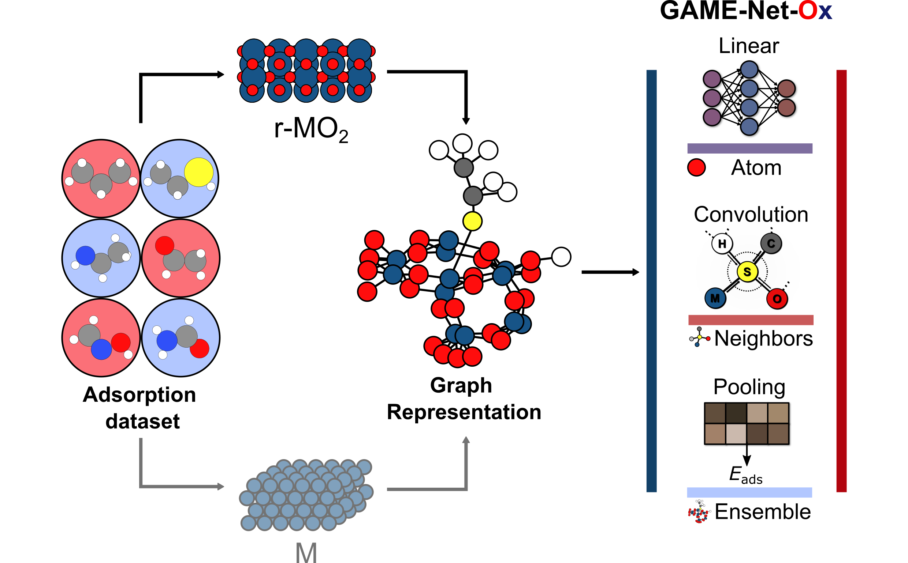

# GAME-Net-Ox

<div style="display: flex; justify-content: center; align-items: center;">
    <p align="center">
     
    </p>
</div>

This repository contains the Python code used to train and evaluate GAME-Net-Ox, a graph neural network to predict DFT adsorption energies for C,H,O,N,S molecules on rutile oxides (RuO2, IrO2, TiO2).

## Installation

GAME-Net-Ox was developed and trained with:

- Python 3.11.8
- PyTorch 2.6.0
- PyTorch Geometric 2.6.1
- (GPU training) CUDA 12.4 on NVIDIA RTX A2000 (12 GB)

Two installation options are provided: a condensed `requirements.txt` (pip) and `environment.yml` (conda). Use conda for the easiest compatibility with CUDA and binary wheels.

Quick install (CPU-only, conda):

```bash
conda create -n oxides_ml python=3.11 -y
conda activate oxides_ml
conda install -c conda-forge numpy scipy pandas scikit-learn matplotlib seaborn plotly ase pubchempy toml networkx jupyterlab ipywidgets -y
conda install -c pytorch pytorch=2.6.0 cpuonly -y
pip install torchinfo==1.8.0
pip install torch-geometric==2.6.1
```

GPU install (development target: CUDA 12.4):

```bash
conda create -n oxides_ml python=3.11 -y
conda activate oxides_ml
# Install CUDA-enabled PyTorch 2.6.0 for cu124
conda install -c pytorch pytorch=2.6.0 cudatoolkit=12.4 -y
pip install torchinfo==1.8.0
# Install PyG companion wheels matching torch-2.6.0+cu124 and then torch-geometric
pip install torch-scatter -f https://data.pyg.org/whl/torch-2.6.0+cu124.html
pip install torch-sparse -f https://data.pyg.org/whl/torch-2.6.0+cu124.html
pip install torch-cluster -f https://data.pyg.org/whl/torch-2.6.0+cu124.html
pip install torch-spline-conv -f https://data.pyg.org/whl/torch-2.6.0+cu124.html
pip install torch-geometric==2.6.1 -f https://data.pyg.org/whl/torch-2.6.0+cu124.html
```

Notes

- If a PyG wheel is not available for your platform, use the PyG installation selector: [PyG install guide](https://pytorch-geometric.readthedocs.io/en/latest/notes/installation.html)
- `requirements.txt` and `environment.yml` are included and pinned for reproducibility. Use `conda env create -f environment.yml` to create the conda env.
- RDKit and other extras are optional and not required by default.

## DFT Dataset

The DFT dataset used to train the model (file `VASP_dataset.csv/.ods`, [DFT data](./data/DFT_data)) will be published on Zenodo as an ASE database and will contain the VASP geometries, settings and metadata.

## Graph Datasets

The different graph datasets used in GAME-Net-Ox can be found in [graph_datasets](./data/graph_datasets)

## Training

Train or fine-tune models using the provided training scripts. Example (runs training loop using a TOML config):

```bash
python scripts/train_mve.py -i scripts/input.toml -o output_dirname
```

To train and perform a nested cross validation (NCV) test use the following script:

```bash
python scripts/train_mve_ncv.py -i scripts/input.toml -o output_dirname
```

## License

Released under the [MIT](./LICENSE) license.

## Reference

- Work in progress: the article associated to this project will be referenced after publication.
